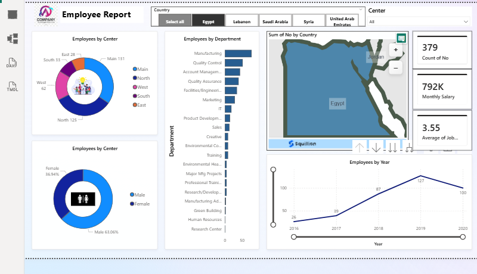

# Employee_Report
هذا المشروع عبارة عن لوحة بيانات تفاعلية لتحليل بيانات الموظفين في مؤسسة متعددة الفروع (تغطي مصر، السعودية، الإمارات، وغيرها). يهدف التقرير إلى تقديم رؤى سريعة ودقيقة للإدارة حول القوة العاملة وتوزيع التكاليف.
📊 لوحة بيانات تقرير الموظفين | Employee Report Dashboard
مشروع تحليل بيانات تفاعلي يهدف إلى تقديم رؤية شاملة حول القوى العاملة وتوزيع الموظفين داخل المؤسسة باستخدام أدوات تحليل البيانات (Power BI / Excel).
🚀 نظرة عامة على المشروع (Project Overview)
تم تصميم هذا التقرير لمساعدة قسم الموارد البشرية (HR) والإدارة العليا في اتخاذ قرارات مبنية على البيانات من خلال مراقبة مؤشرات الأداء الرئيسية (KPIs) وتحليل توزيع الموظفين جغرافياً ووظيفياً في منطقة الشرق الأوسط (مصر، السعودية، الإمارات، إلخ).
🛠️ المميزات التقنية (Key Features)
المؤشرات الرئيسية (KPIs): عرض فوري لإجمالي عدد الموظفين (379)، إجمالي الرواتب الشهرية (792K)، ومتوسط تقييم الأداء (3.55).
التحليل الديموغرافي: توزيع الموظفين حسب "المركز" و "النوع الاجتماعي" باستخدام مخططات حلقية (Donut Charts).
هيكل الأقسام: رسم بياني شريطي (Bar Chart) يوضح حجم العمالة في كل قسم (مثل التصنيع، التسويق، وتكنولوجيا المعلومات).
تحليل النمو الزمني: مخطط خطي (Line Chart) يتتبع نمو عدد الموظفين من عام 2016 حتى 2020.
التفاعلية والجغرافيا: خريطة تفاعلية مدعومة بـ "Slicers" لفلترة البيانات حسب الدولة (مصر، السعودية، لبنان، سوريا، الإمارات).
🧰 الأدوات المستخدمة (Tools Used)
Data Visualization: Power BI (أو الأداة التي استخدمتها).
Data Processing: Power Query لتنظيف ومعالجة البيانات.
Analytics: استخدام لغة DAX لإنشاء المقاييس (Measures) مثل متوسط الرواتب والنسب المئوية.
📈 النتائج المستفادة (Insights)
تحديد المراكز الأكثر كثافة بالموظفين (المركز الرئيسي والشمال).
مراقبة التوازن بين الجنسين داخل الأقسام المختلفة.
تتبع نمو الشركة عبر السنوات وملاحظة الذروة في عام 2019.

